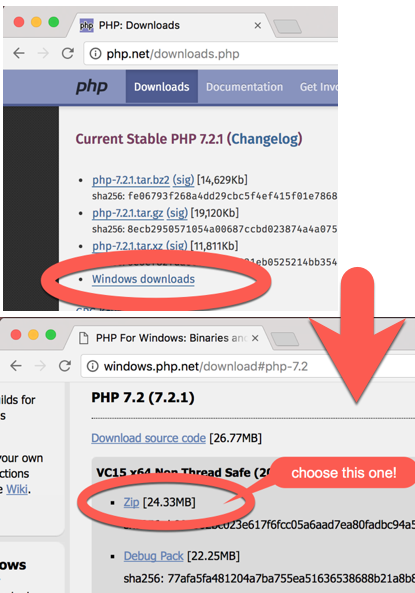
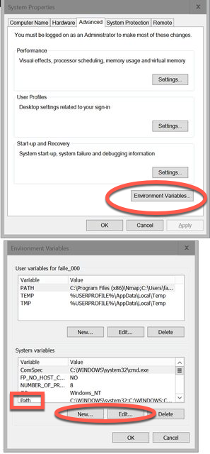

# PHP Windows setup\label{appendix_php}

## Check if you have PHP installed and working

You need PHP version 7.2.5 or later.

Check your PHP version at the command line with:

```bash
    > php -v
    PHP 7.3.1 (cli) (built: May  9 2018 19:49:10)
    Copyright (c) 1997-2017 The PHP Group
    Zend Engine v3.1.0, Copyright (c) 1998-2017 Zend Technologies

```

If your version is older than 7.2.5, or you get an error about command not understood, then complete the steps below.


### Download the latest version of PHP

Get the latest (7.4 at the time of writing) PHP Windows ZIP from:

- [php.net](http://php.net/downloads.php) click the **Windows Downloads** link

NOTE: If installing on Windows ensure you are **displaying file extensions**, e.g. so you see `php.exe` and `php.ini` not just `php` - Don't relyon Windows to show the right icon while *hiding the full filename*...

Figure \ref{windows_zip} shows a screenshot of the `php.net` general and Windows downloads page. The `ZIP` file to download (containing `php.exe` ... don't download the source code version unless you want to build the file from code ...):



Do the following:

- unzip the PHP folder into: `C:\php`

- so you should now have a file `php.exe` inside `C:\php`, along with lots of other files

- make a copy the file `C:\php\php.ini-development`, naming the copy  `C:\php\php.ini`

## Add the **path** to `php.exe` to your System environment variables

Whenever you type a command at the CLI (Command Line Interface) Windows searches through all the directories in its `path` environment variable. In order to use PHP at the CLI we need to add `c:\php` to the `path` environment variable so the  `php.exe` executable can be found.

Via the System Properties editor, open your Windows Evironment Variables editor. The **system** environment variablesa re in the lower half of the Environment Variables editor. If there is already a system variable named `Path`, then select it and click the **Edit** button. If none exists, then click the **New** button, naming the new variable **path**. Add a new value to the **path** variable with the value `c:\php`. Then click all the **Okay** buttons needed to close all these windows.

Now open a windows **Cmd** window and try the `php -v` - hopefully you'll see confirmation that your system now has PHP installed and in the **path** for CLI commands.

Figure \ref{env2} shows a screenshot of the Windows system and environment variables editor.



## Check your `php.ini` file
 
Open a new terminal CLI window (so new settings are loaded) and run `php --ini` to confirm the location of the `php.ini` file that you've just created. Note the following for a Mac - for Windows it should (hopefully) tell you it found the ini file in `c:\php\php.ini`:

```bash
    $ php --ini
    Configuration File (php.ini) Path: /Applications/MAMP/bin/php/php7.1.8/conf
    Loaded Configuration File:         /Applications/MAMP/bin/php/php7.1.8/conf/php.ini
    Scan for additional .ini files in: (none)
    Additional .ini files parsed:      (none)
```


## PHP Info & SQL driver test

For database work we need to enable the PDO^[PDO = PHP Database Objects, the modern library for managing PHP program communications with databases. Avoid using old libries like `mysql` (security issues) and even `mysqli` (just for MySQL). PDO offers an object-oriented, standardized way to communicate with many different database systems. So a project could change the databse management system (e.g. from Oracle to MySQL to SQLite), and only the database connetion optins need to change - all other PDO code will work with the new database system!] options for MySQL and SQLite (see later database exercises for how to do this)

Although PHP may have been installed, and its SQL drivers too, they may have not been enabled. For this module we’ll be using the SQLite and MySQL drivers for PHP – to talk to databases. The function `phpinfo()` is very useful since it displays many of the settings of the PHP installation on your computer / website.

1. In the current (or a temporary) direcotry, create file `info.php` containing just the following 2 lines of code:

    ```php
        <?php
        print phpinfo();
    ```

2. At the CLI run the built-in PHP web server to serve this page, and visit: `localhost:8000/info.php` in your web browser

    ```bash
        php -S localhost:8000
    ```

In the PDO section of the web page (`CTL-F` and search for `pdo` ...) we are looking for **mysql** and **sqlite**. If you see these then great!


Figure \ref{info} shows a screenshot the Windows system and environment variables editor.


But, if you see “no value” under the PDO drivers section, then we’ll need to edit file `c:\php\php.ini`:

1. In a text editor open file `c:\php\php.ini` and locate the “Dynamic Extensions” section in this file (e.g. use the editor Search feature - or you could just search for `pdo`)


2. Now remove the semi-colon `;` comment character at the beginning of the lines for the SQLite and MySQL DLLs to enable them as shown here:

    ```bash
        ;;;;;;;;;;;;;;;;;;;;;;
        ; Dynamic Extensions ;
        ;;;;;;;;;;;;;;;;;;;;;;

        .. other lines here ...
        extension=php_pdo_mysql <<<<<<<<<< here is the PDO MYSQL driver line
        ;extension=php_pdo_oci
        ;extension=php_pdo_odbc
        ;extension=php_pdo_pgsql
        extension=php_pdo_sqlite <<<<<<<<  here is the PDO SQLITE driver line
    ```
3. Save the file. Close your Command Prompt, and re-open it (to ensure new settings are used).

    -- Run the webserver again and visit: `localhost:8000/info.php` to check the PDO drivers.


NOTE: Knowing how to view `phpinfo()` is very handy when checking server features.
